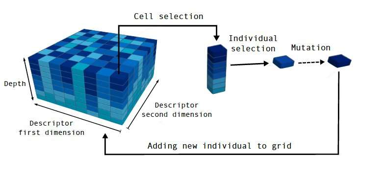
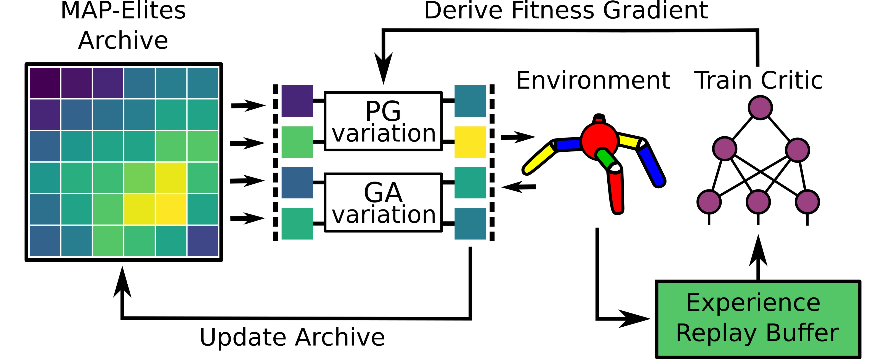

# MAP-Elites (illumination algorithm)

## MAP-Elites
`map-elites.py`

## Environment
The `MAPElites` Archive (`self.genomes: np.ndarray-object` & `self.fitnesses: np.ndarray`).

Uses the `Sodarace` Environment's `self.fitness()` method to Derive The Fitness.

Of a `seed: Dict` returned by the `DiffModel` method `self.generate_program()`.

